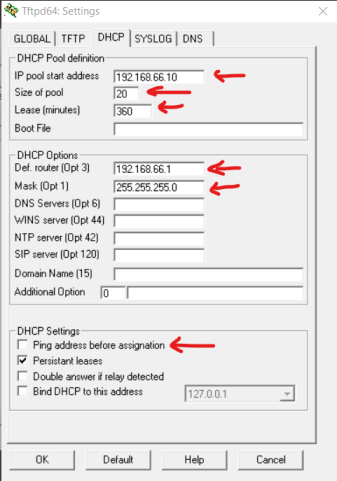
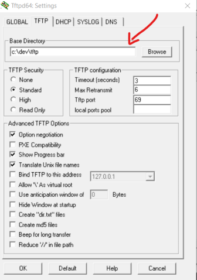
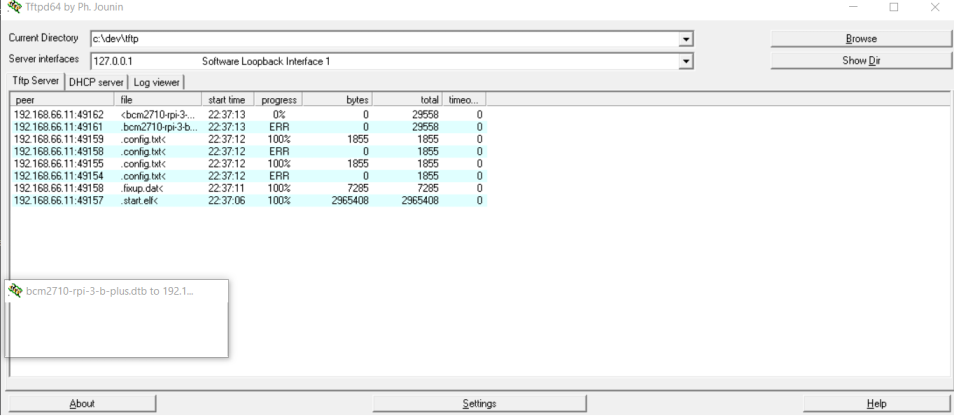

# Running DenLab on Raspberry Pi

## NOTE

This is for development purposes only - DenLab doesn't currently boot on Raspberry Pi! Use this guide if you want to set up a development environment.

64-bit only, so you need a Raspberry Pi 3 or newer.

## Running in QEMU

### Step 1: Set Up DenLab

Please follow [build instructions](BuildInstructions.md) to download and build DenLab. Make sure everything builds successfully for x86.

### Step 2: Build and run in emulator

Use the following command to build and run the AArch64 version of the system:

```console
Meta/denlab.sh run aarch64
```

It should build DenLab and open a QEMU window, similar to the x86 version. You should see some messages in the terminal.

You can also run it under gdb with:

```console
Meta/denlab.sh gdb aarch64
```

## Running on real hardware using an SD card

### Step 0: Build a DenLabOS SD card image

You can build an SD card image for the Raspberry Pi 3 and 4 with:

```console
ninja -C Build/aarch64 raspberry-pi-image
```

The generated disk image will be written to `Build/aarch64/raspberry_pi_disk_image`.
Write this image to the SD card you want to use to boot DenLab using a command such as:

```console
sudo cp Build/aarch64/raspberry_pi_disk_image /dev/sdx && sync
```

(Replace `/dev/sdx` with your sd card device file)

### Step 1: Connect your Raspberry Pi to your PC using a UART cable

Please follow one of the existing guides (for example [here](https://scribles.net/setting-up-serial-communication-between-raspberry-pi-and-pc)) and make sure UART is working on Raspberry Pi OS before proceeding.

### Step 2: Put the SD Card in the Raspberry Pi and power on

You should start seeing some messages in your UART terminal window. The default configuration is 115200-8-N-1 (115200 baud, one start bit, 8 data bits, no parity).

## Running on real hardware using network (Raspberry Pi 3)

### Prerequisites

There are multiple ways to set up your network. The easiest way is a direct connection between the Raspberry Pi and your PC. To achieve this your PC has to have an Ethernet port.

Here's the [Raspberry Pi Documentation](https://www.raspberrypi.com/documentation/computers/raspberry-pi.html#debugging-network-boot-mode) on booting from the network.

### Step 1: Make sure OTP mode is enabled on the board

This is enabled by default on Raspberry Pi 3+. For the previous boards please see the section [Debugging Network Boot Mode](https://www.raspberrypi.com/documentation/computers/raspberry-pi.html#debugging-network-boot-mode) of the Raspberry Pi documentation.

### Step 2: Copy all files from the original SD Card to your PC

This directory will serve as a TFTP server, sending files to the Raspberry Pi when requested.

### Step 2: Set up the network interface

Switch the network interface to static mode (static IP) and disable the firewall.

### Step 3: Set up network services

Booting Raspberry Pi requires DHCP and TFTP servers.

On Windows, you can use the [Tftpd32](https://bitbucket.org/phjounin/tftpd64/src/master/) program.

Example configuration for DHCP:



Make sure you **disable** the `Ping address before assignment` option.

Example configuration for TFTP:



The only option worth noting is `Base Directory` which should contain the files from the SD Card.

### Step 4: Power up the Raspberry Pi

Remove the SD Card, connect an Ethernet cable between the Raspberry Pi and your PC and power on the board.

After 5-10 seconds you should see files being served by the TFTP server:



The system should boot normally as it would from the SD Card.

### Step 5: Modify config.txt and copy DenLab kernel

Similarly to booting from SD Card (see above), modify `config.txt` and copy the DenLab kernel to the TFTP directory.

### Step 6: Reset Raspberry Pi

You should start seeing some DenLab messages in your UART terminal window.
